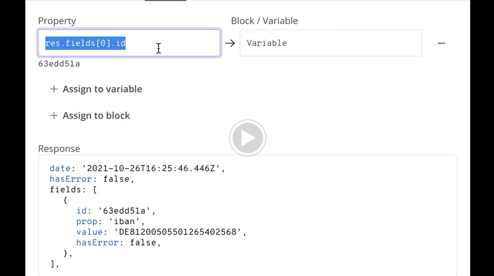

# Recruitment task for company X

## Task content



### Summary
A component to select keys from a JSON object that returns the keyʼs path.

### User Story
X users can connect an API and need a user-friendly solution to select values from the response.

### Objective
Build a React Function Component that takes in JSON data as an argument and satisfies the acceptance criteria.

### Acceptance Criteria
-  The JSON data is correctly displayed: indention, (curly) brackets, string values, number values, boolean values, arrays, objects, etc.
- All keys can be interacted with and are highlighted (e.g. color: blue)
- When a user clicks on a key, it shows its path and value:
  - When a user clicks on “date” it shows “res.date” and "2021-10-27T07:49:14.896Z"
  - When a user clicks on “hasError” it shows “res.hasError” and “false”
  - When a user clicks on “prop” in the first object in the `fields` array, it shows
“res.fields[0].prop” and “iban”

### Out of Scope
An input field that displays the correct value when given a path to the property (as seen in the video)

### Bonus points
Use Typescript

### Demo Data
```
{
   "date":"2021-10-27T07:49:14.896Z",
   "hasError":false,
   "fields":[
      {
         "id":"4c212130",
         "prop":"iban",
         "value":"DE81200505501265402568",
         "hasError":false
      }
   ]
}
```

## How to run the app

In the project directory, you can run:

### `npm start`

I have also deployed the app to vercel, you can check it here:

### [https://recruitment-task-json-explorer.vercel.app/](https://recruitment-task-json-explorer.vercel.app/)

## Comments from developer:

Actually this task was pretty nice I really enjoyed to worked on it.

1. I wanted to build fast, so I have used CRA + Typescript + Tailwind
2. In Tailwind, I could move colors to some variables, but decided to not to do that, this is not exactly "production" quality project, I wanted to demonstrate skills you asked for.
3. I've added TS, what was interesting for me `JSON.parse(json)` has type `any`. I decided to follow this practice in whole project, although in real project would be good to have some discussion if that could be improved.
4. I have decided to add one functionality out of scope - textarea to paste json. It was easier to test this component for me. Should be also easier for reviewer.
